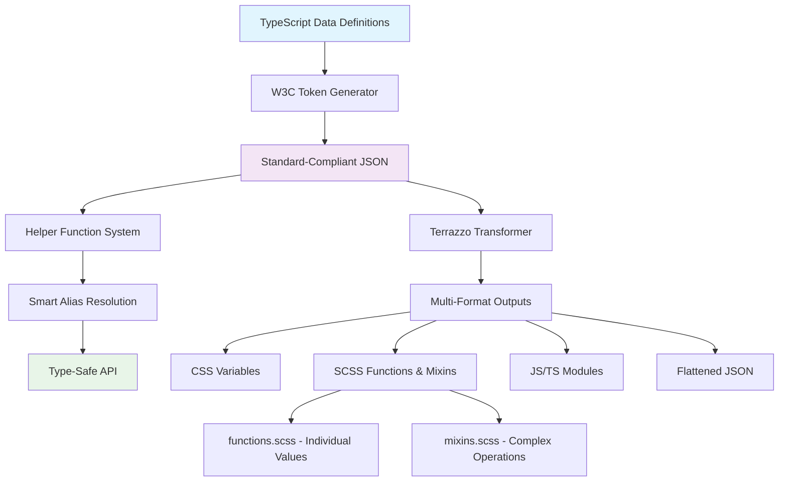

# 🎨 Design Tokens Generator

> A type-safe, W3C-compliant design token system that bridges the gap between design and development.

[](https://www.typescriptlang.org/)
[](https://www.w3.org/community/design-tokens/)
[](#)
[](https://www.npmjs.com/package/@choiceform/design-tokens)

## 🚀 Why Choose This Library?

### ⚡ Optimized Developer Experience

- **Type-Safe**: 100% TypeScript with strict mode, catching errors at compile time.
- **Intelligent Autocomplete**: Full IDE support for autocompletion and type checking.
- **Dynamic Aliases**: Intuitive aliases like `background.default` and `text.secondary`.
- **Live Reload**: See changes instantly when you modify tokens.

### 🎯 Advanced Architecture

- **W3C Compliant**: Fully adheres to the latest W3C Design Tokens specification.
- **Multi-Theme Support**: Seamless light/dark mode switching with a single codebase.
- **Cross-Platform Exports**: Comprehensive output formats including CSS, SCSS, JavaScript, and TypeScript.
- **Modern Toolchain**: Leveraging Node.js scripts for generation and Terrazzo for transformation.

### 🔥 Powerful and Complete

- **373+ Tokens**: A rich set of meticulously designed tokens covering colors, typography, spacing, shadows, and more.
- **Smart Alias System**: Dynamically generated from data to ensure consistency.
- **Advanced Helper Functions**: Convenient APIs like `color()`, `spacing()`, and `shadow()`.
- **Complete Test Coverage**: Quality assured with both integration and unit tests.

## 📦 Quick Start

### Installation

```bash
# Install with npm
npm install @choiceform/design-tokens

# Install with pnpm (recommended)
pnpm add @choiceform/design-tokens

# Install with yarn
yarn add @choiceform/design-tokens
```

### Development Setup

```bash
# Install dependencies
pnpm install

# Build tokens
pnpm run build

# Development mode (with live reload)
pnpm run dev
```

### Usage

#### 🔥 JavaScript/TypeScript

```javascript
import { color, spacing, shadow, typography } from "@choiceform/design-tokens";

// 🎨 Colors - with theme and alias support
const styles = {
  background: color("background.default"), // → var(--color-background-default)
  color: color("text.secondary", "dark"), // → foreground color for dark theme
  border: color("border.strong", 0.5), // → border color with 50% opacity
};

// 📏 Spacing - flexible and versatile
const layout = {
  padding: spacing(4), // → "1rem"
  margin: spacing("1/2"), // → "50%"
  gap: spacing("[10vh]"), // → "10vh"
  inset: spacingList([2, 4]), // → "0.5rem 1rem"
};

// ✨ Shadows - theme-aware
const elevation = {
  boxShadow: shadow("md"), // → medium shadow
  dropShadow: shadow("lg", "dark"), // → large shadow for dark theme
  textShadow: shadowList(["sm", "md"]), // → combination of multiple shadows
};

// 📝 Typography - complete preset styles
const textStyles = typography("heading.large"); // → full typography object
const cssString = typographyStyles("body.medium"); // → CSS string
```

#### 🎨 SCSS

```scss
// Import functions and mixins (in order)
@import "path/to/functions"; // Functions for individual values
@import "path/to/mixins"; // Mixins for complex operations

.my-component {
  // 🎨 Colors - identical API to JS version
  background: color("background.default");
  color: color("text.secondary", 0.8);
  border: 1px solid color("border.default");

  // 📏 Spacing - supports all JS features
  padding: spacing(4); // → "1rem"
  margin: spacing("1/2"); // → "50%"
  gap: spacing("[10vh]"); // → "10vh"

  // ✨ Typography - complete preset application
  @include typography-styles("heading.large");

  // 📱 Responsive design
  @include up("md") {
    padding: spacing(6);
    @include typography-styles("heading.display");
  }

  // 🌓 Other design tokens
  border-radius: radius("md");
  box-shadow: shadow("lg");
  z-index: z-index("modal");
}

// 📱 Responsive typography example
.responsive-heading {
  @include responsive-typography(
    (
      "default": "heading.small",
      "md": "heading.medium",
      "lg": "heading.large",
    )
  );
}
```

## 🏗️ Architecture



### 📦 Output Format Comparison

| Format             | File Size | Features                                  | Best For                               |
| ------------------ | --------- | ----------------------------------------- | -------------------------------------- |
| **functions.scss** | ~19KB     | 🎯 Individual values, identical JS API    | Component styling, utility classes     |
| **mixins.scss**    | ~6.8KB    | 🔥 Multi-property application, responsive | Complex components, typography presets |
| **tokens.css**     | ~30KB     | 🌍 Universal browser support              | Runtime theming, CSS-only projects     |
| **tokens.js**      | ~25KB     | ⚡ Runtime logic, conditional styling     | React, Vue, dynamic applications       |

**💡 Recommendation**: Use SCSS files for build-time optimization and CSS files for runtime flexibility.

## 📊 Token Ecosystem

| Token Type         | Count    | JS/TS Support                           | SCSS Support                                 | Use Cases                           |
| ------------------ | -------- | --------------------------------------- | -------------------------------------------- | ----------------------------------- |
| **🎨 Colors**      | 243      | `color()`, `colorVar()`, aliases        | `color()`, `color-var()`, identical API      | UI background, text, borders, icons |
| **📝 Typography**  | 39       | `typography()`, `fontFamily()`, etc     | `typography-styles()`, `font-family()`, etc  | Headings, body text, code, labels   |
| **📏 Spacing**     | Flexible | `spacing()`, `spacingList()`, fractions | `spacing()`, `spacing-list()`, identical API | Layout, gaps, sizing                |
| **✨ Shadows**     | 22       | `shadow()`, `shadowList()`, themes      | `shadow()`, `shadow-list()`, themes          | Cards, buttons, overlays            |
| **📱 Breakpoints** | 6        | `up()`, `down()`, `between()`, `only()` | `@mixin up()`, `@mixin down()`, etc          | Media queries, responsive design    |
| **📚 Z-index**     | 9        | `zIndex()`, `zIndexList()`              | `z-index()`, `z-index-list()`                | Modals, dropdowns, sticky headers   |
| **🔄 Radius**      | 3        | `radius()`, `radiusList()`              | `radius()`, `radius-list()`                  | Buttons, cards, inputs              |

## 🎯 Core Strengths

### 💎 SCSS Powerhouse Features

Our SCSS integration provides a **complete, identical API** to the JavaScript version with additional SCSS-specific superpowers:

```scss
// 🎯 1. Identical API to JavaScript
.component {
  // Same function names, same parameters, same results
  background: color(
    "background.default"
  ); // ✓ Same as JS: color("background.default")
  padding: spacing(4); // ✓ Same as JS: spacing(4)
  box-shadow: shadow("md"); // ✓ Same as JS: shadow("md")
}

// 🔥 2. SCSS-Only Superpowers
.advanced {
  // Multi-property application with mixins
  @include typography-styles(
    "heading.large"
  ); // Applies 5 CSS properties at once

  // Responsive breakpoint mixins
  @include up("md") {
    @include typography-styles("heading.display");
  }

  // Utility mixins for common patterns
  @include text-ellipsis(); // Single-line text truncation
  @include text-ellipsis-multiline(3); // Multi-line text truncation
}

// 🎨 3. Zero Learning Curve
// If you know the JS API, you already know the SCSS API!
.button {
  // JS: { background: color("background.primary", { alpha: 0.9 }) }
  background: color("background.primary", 0.9); // Same result in SCSS

  // JS: { padding: spacingList([2, 4]) }
  padding: spacing-list(2, 4); // Same result in SCSS
}
```

### 1. Smart Alias System 🧠

No more memorizing complex token paths. Use intuitive aliases instead:

```javascript
// ❌ Traditional Way - Hard to remember
color("color.background.surface.default.light");

// ✅ Smart Alias - Intuitive and easy
color("background.default"); // background color
color("text.secondary"); // foreground color
color("border.strong"); // border color
color("icon.primary"); // icon color
```

### 2. Zero-Cost Theming 🌓

A single API provides perfect multi-theme support:

```javascript
// Automatically adapts to the current theme
const button = {
  background: color("background.default"),
  color: color("text.default"),
  boxShadow: shadow("md"),
};
```

### 3. Type Safety Guaranteed 🛡️

Catch errors at compile time, not at runtime:

```typescript
// ✅ Type check passes
color("background.default"); // Correct alias
spacing(4); // Correct value
shadow("md"); // Correct size

// ❌ Compile-time error
color("background.invalid"); // Error: Alias does not exist
spacing("invalid"); // Error: Invalid spacing value
shadow("xxx"); // Error: Undefined shadow
```

### 4. Developer Experience Boosts ⚡

```javascript
// 🔥 Bulk Operations
const margins = spacingList([2, 4, 6, 8]); // → "0.5rem 1rem 1.5rem 2rem"
const shadows = shadowList(["sm", "md"]); // → combination of multiple shadows

// 🎨 Opacity Control
color("background.default", 0.8); // → rgba(..., 0.8)

// 📱 Responsive Breakpoints
up("md"); // → "@media screen and (min-width: 48rem)"
down("lg"); // → "@media screen and (max-width: 63.98rem)"
between("sm", "xl"); // → "@media screen and (min-width: 40rem) and (max-width: 79.98rem)"
only("md"); // → "@media screen and (min-width: 48rem) and (max-width: 63.98rem)"

// 🎯 Device-specific aliases
mobile(); // → "@media screen and (min-width: 29.6875rem)"
tablet(); // → "@media screen and (min-width: 48rem) and (max-width: 63.98rem)"
desktop(); // → "@media screen and (min-width: 64rem)"
```

## 🛠️ Build & Deployment

### Development Commands

```bash
# 🚀 Dev Mode (Recommended)
pnpm run dev                # Start dev server + watch mode

# 📦 Build Commands
pnpm run build              # Build all tokens
pnpm run build:colors       # Build only color tokens
pnpm run build:helpers      # Build helper functions

# 🧪 Test Commands
pnpm run test               # Run all tests
pnpm run test:helpers       # Test helper functions
pnpm run test:integration   # Run integration tests

# 🔄 Transform Commands
pnpm run terrazzo           # Transform into multiple formats (CSS, SCSS, JS, TS)
pnpm run terrazzo:watch     # Transform in watch mode

# 📁 Generated Files After Build:
# dist/tokens.css           → CSS Custom Properties
# dist/functions.scss       → SCSS Functions (1000+ lines)
# dist/mixins.scss          → SCSS Mixins (400+ lines)
# dist/tokens.js            → JavaScript Helpers
```

### Continuous Integration

```yaml
# .github/workflows/tokens.yml
name: Design Tokens CI
on: [push, pull_request]
jobs:
  test:
    runs-on: ubuntu-latest
    steps:
      - uses: actions/checkout@v3
      - uses: pnpm/action-setup@v2
      - name: Install Dependencies
        run: pnpm install
      - name: Build Tokens
        run: pnpm run build
      - name: Run Tests
        run: pnpm run test
      - name: Generate Outputs
        run: pnpm run terrazzo
```

## 📁 Project Structure

```
packages/generate-tokens/
├── 📊 data/                    # Data Definition Layer
│   ├── colors-data.cjs         # Color System Definition
│   ├── typography-data.cjs     # Typography System Definition
│   └── spacing-data.cjs        # Spacing System Definition
├── 🔄 generate/                # Transformation Script Layer
│   ├── generate-w3c-*.cjs      # W3C Standard Transformers
│   └── build-helpers.cjs       # Helper Function Builder
├── 🎯 src/helpers/             # Helper Function Layer
│   ├── colors.ts               # Color Helpers
│   ├── spacing.ts              # Spacing Helpers
│   └── shadows.ts              # Shadow Helpers
├── 📤 output/                  # W3C Output Layer
│   ├── colors-w3c.json         # W3C-compliant color tokens
│   └── typography-w3c.json     # W3C-compliant typography tokens
├── 📦 dist/                    # Multi-Format Output Layer
│   ├── tokens.css              # CSS Custom Properties
│   ├── tokens.scss             # Sass Variables and Mixins
│   ├── functions.scss          # SCSS Functions (color, spacing, typography, etc.)
│   ├── mixins.scss             # SCSS Mixins (breakpoints, typography-styles, etc.)
│   ├── tokens.js               # JavaScript Modules
│   ├── tokens.d.ts             # TypeScript Definitions
│   └── helpers.js              # Compiled Helper Functions
├── 🧪 tests/                   # Test Suite
│   ├── helpers/                # Helper Function Tests
│   ├── tokens/                 # Token Tests
│   └── integration/            # Integration Tests
└── 📋 docs/                    # Docs Directory
    └── README.md               # The README you are reading
```

## 🌟 Best Practices

### 1. Token Naming Conventions

```javascript
// ✅ Recommended: Semantic Naming
color("background.default"); // Default background color
color("text.secondary"); // Secondary foreground color
color("border.default"); // Default border color
```

### 2. Theming Strategy

```javascript
// 🎨 Responsive Theming
const getButtonStyles = (theme = "auto") => ({
  background: color("background.accent", theme),
  color: color("text.on-accent", theme),
  "&:hover": {
    background: color("background.accent-hover", theme),
  },
});

// 🌓 System Theme Detection
const useSystemTheme = () => {
  const [theme, setTheme] = useState("light");

  useEffect(() => {
    const media = window.matchMedia("(prefers-color-scheme: dark)");
    setTheme(media.matches ? "dark" : "light");

    const handler = (e) => setTheme(e.matches ? "dark" : "light");
    media.addEventListener("change", handler);

    return () => media.removeEventListener("change", handler);
  }, []);

  return theme;
};
```

### 3. SCSS Best Practices

```scss
// 🚀 1. Correct Import Order (Critical!)
@import "path/to/functions"; // Must be first - provides function definitions
@import "path/to/mixins"; // Must be second - uses functions internally

// 🎯 2. Use Functions for Individual Values
.card {
  background: color("background.default");
  padding: spacing(4);
  border-radius: radius("md");
  box-shadow: shadow("sm");
}

// 🔥 3. Use Mixins for Complex Operations
.heading {
  @include typography-styles("heading.large"); // 5 properties applied at once
  @include text-ellipsis(); // Multiple utility properties
}

// 📱 4. Responsive Design Patterns
.component {
  // Base styles with functions
  padding: spacing(4);
  @include typography-styles("body.medium");

  // Responsive with mixins
  @include up("md") {
    padding: spacing(6);
    @include typography-styles("body.large");
  }

  @include up("lg") {
    @include typography-styles("heading.small");
  }
}

// 🎨 5. Advanced Responsive Typography
.hero-title {
  @include responsive-typography(
    (
      "default": "heading.medium",
      // Mobile
      "md": "heading.large",
      // Tablet
      "lg": "heading.display",
      // Desktop
    )
  );
}
```

### 4. Performance Tips

```javascript
// ⚡ Optimize with bulk operations
const spacing = spacingList([2, 4, 6, 8]); // One call for multiple values
const shadows = shadowList(["sm", "md"]); // Avoids multiple function calls

// 🎯 Use tree-shaking
import { color } from "@choiceform/design-tokens"; // Import only what you need

// 📦 Leverage build-time optimizations
const styles = {
  // Static values are optimized at build time
  padding: spacing(4), // → "1rem"
  // Dynamic values are computed at runtime
  margin: spacing(props.size), // → calculated at runtime
};
```

```scss
// 📦 SCSS Performance Tips
.optimized {
  // ✅ Efficient: Use functions for individual properties
  padding: spacing(4);
  color: color("text.default");

  // ✅ Efficient: Use mixins for multiple properties
  @include typography-styles("body.large");

  // ❌ Avoid: Don't call functions inside loops
  // Use variables instead when possible
  $base-spacing: spacing(4);

  &::before {
    margin: $base-spacing;
  }

  &::after {
    margin: $base-spacing;
  }
}
```

## 🤝 Contributing

We welcome all forms of contributions!

### How to Contribute

1. **Fork the project** → Create your feature branch
2. **Commit your changes** → Ensure all tests pass
3. **Open a Pull Request** → Provide a detailed description
4. **Code Review** → Collaborate to improve code quality

### Development Setup

```bash
# 1. Clone your fork
git clone <your-fork-url>
cd design-tokens

# 2. Install dependencies
pnpm install

# 3. Start the development server
pnpm run dev

# 4. Run tests
pnpm run test
```

### Commit Conventions

```bash
# Add a new feature
git commit -m "feat: add shadow helper function"

# Fix a bug
git commit -m "fix: resolve color alias resolution issue"

# Update documentation
git commit -m "docs: update README with new examples"

# Add tests
git commit -m "test: add unit tests for spacing helper"
```

## 📄 License

MIT License - see the [LICENSE](LICENSE) file for details.

## 🙏 Acknowledgements

- **W3C Design Tokens Community Group** - For standardizing design tokens
- **Terrazzo** - For the token transformation tool
- **Vitest** - For the powerful testing framework
- **TypeScript** - For providing type safety

---

<div align="center">

**Manage your design tokens the modern way 🎨**

[Quick Start](#-quick-start) · [View Examples](../examples/) · [API Docs](#) · [Changelog](#)

</div>
