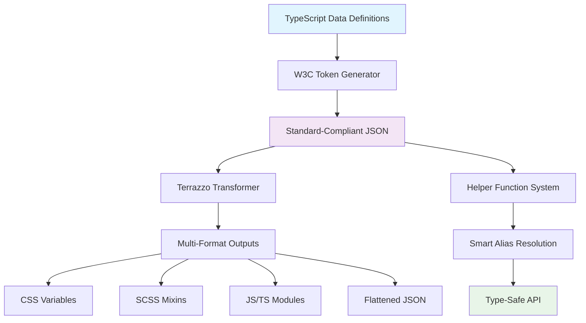

# 🎨 Design Tokens Generator

> A type-safe, W3C-compliant design token system that bridges the gap between design and development.

[](https://www.typescriptlang.org/)
[](https://www.w3.org/community/design-tokens/)
[](#)

## 🚀 Why Choose This Library?

### ⚡ Optimized Developer Experience

- **Type-Safe**: 100% TypeScript with strict mode, catching errors at compile time.
- **Intelligent Autocomplete**: Full IDE support for autocompletion and type checking.
- **Dynamic Aliases**: Intuitive aliases like `bg.default` and `fg.secondary`.
- **Live Reload**: See changes instantly when you modify tokens.

### 🎯 Advanced Architecture

- **W3C Compliant**: Fully adheres to the latest W3C Design Tokens specification.
- **Multi-Theme Support**: Seamless light/dark mode switching with a single codebase.
- **Cross-Platform Exports**: Comprehensive output formats including CSS, SCSS, JavaScript, and TypeScript.
- **Modern Toolchain**: Leveraging Node.js scripts for generation and Terrazzo for transformation.

### 🔥 Powerful and Complete

- **373+ Tokens**: A rich set of meticulously designed tokens covering colors, typography, spacing, shadows, and more.
- **Smart Alias System**: Dynamically generated from data to ensure consistency.
- **Advanced Helper Functions**: Convenient APIs like `color()`, `spacing()`, and `shadow()`.
- **Complete Test Coverage**: Quality assured with both integration and unit tests.

## 📦 Quick Start

### Installation

```bash
# Install dependencies
pnpm install

# Build tokens
pnpm run build

# Development mode (with live reload)
pnpm run dev
```

### Usage

```javascript
import { color, spacing, shadow } from "@your-org/design-tokens";

// 🎨 Colors - with theme and alias support
const styles = {
  background: color("bg.default"), // → var(--color-background-default)
  color: color("fg.secondary", "dark"), // → foreground color for dark theme
  border: color("bd.strong", { alpha: 0.5 }), // → border color with 50% opacity
};

// 📏 Spacing - flexible and versatile
const layout = {
  padding: spacing(4), // → "1rem"
  margin: spacing("1/2"), // → "50%"
  gap: spacing("[10vh]"), // → "10vh"
  inset: spacingList([2, 4]), // → "0.5rem 1rem"
};

// ✨ Shadows - theme-aware
const elevation = {
  boxShadow: shadow("md"), // → medium shadow
  dropShadow: shadow("lg", "dark"), // → large shadow for dark theme
  textShadow: shadowList(["sm", "md"]), // → combination of multiple shadows
};
```

## 🏗️ Architecture



## 📊 Token Ecosystem

| Token Type         | Count    | Features                            | Use Cases                           |
| ------------------ | -------- | ----------------------------------- | ----------------------------------- |
| **🎨 Colors**      | 243      | Theming, opacity, smart aliases     | UI background, text, borders, icons |
| **📝 Typography**  | 39       | Atomic + composite, negative values | Headings, body text, code, labels   |
| **📏 Spacing**     | Flexible | `calc()`-based, fraction support    | Layout, gaps, sizing                |
| **✨ Shadows**     | 22       | Multiple shadows, theme variants    | Cards, buttons, overlays            |
| **📱 Breakpoints** | 22       | Responsive, container queries       | Media queries, layout breakpoints   |
| **📚 Z-index**     | 9        | Layer management                    | Modals, dropdowns, sticky headers   |
| **🔄 Radius**      | 3        | Corner radius sizes                 | Buttons, cards, inputs              |

## 🎯 Core Strengths

### 1. Smart Alias System 🧠

No more memorizing complex token paths. Use intuitive aliases instead:

```javascript
// ❌ Traditional Way - Hard to remember
color("color.background.surface.default.light");

// ✅ Smart Alias - Intuitive and easy
color("bg.default"); // background color
color("fg.secondary"); // foreground color
color("bd.strong"); // border color
color("ic.primary"); // icon color
```

### 2. Zero-Cost Theming 🌓

A single API provides perfect multi-theme support:

```javascript
// Automatically adapts to the current theme
const button = {
  background: color("bg.primary"),
  color: color("fg.onPrimary"),
  boxShadow: shadow("md"),
};

// Force a specific theme
const darkButton = {
  background: color("bg.primary", "dark"),
  color: color("fg.onPrimary", "dark"),
};
```

### 3. Type Safety Guaranteed 🛡️

Catch errors at compile time, not at runtime:

```typescript
// ✅ Type check passes
color("bg.default"); // Correct alias
spacing(4); // Correct value
shadow("md"); // Correct size

// ❌ Compile-time error
color("bg.invalid"); // Error: Alias does not exist
spacing("invalid"); // Error: Invalid spacing value
shadow("xxx"); // Error: Undefined shadow
```

### 4. Developer Experience Boosts ⚡

```javascript
// 🔥 Bulk Operations
const margins = spacingList([2, 4, 6, 8]); // → "0.5rem 1rem 1.5rem 2rem"
const shadows = shadowList(["sm", "md"]); // → combination of multiple shadows

// 🎨 Opacity Control
color("bg.primary", { alpha: 0.8 }); // → rgba(..., 0.8)

// 📱 Responsive Breakpoints
breakpoint("tablet"); // → "@media (min-width: 768px)"
```

## 🛠️ Build & Deployment

### Development Commands

```bash
# 🚀 Dev Mode (Recommended)
pnpm run dev                # Start dev server + watch mode

# 📦 Build Commands
pnpm run build              # Build all tokens
pnpm run build:colors       # Build only color tokens
pnpm run build:helpers      # Build helper functions

# 🧪 Test Commands
pnpm run test               # Run all tests
pnpm run test:helpers       # Test helper functions
pnpm run test:integration   # Run integration tests

# 🔄 Transform Commands
pnpm run terrazzo           # Transform into multiple formats
pnpm run terrazzo:watch     # Transform in watch mode
```

### Continuous Integration

```yaml
# .github/workflows/tokens.yml
name: Design Tokens CI
on: [push, pull_request]
jobs:
  test:
    runs-on: ubuntu-latest
    steps:
      - uses: actions/checkout@v3
      - uses: pnpm/action-setup@v2
      - name: Install Dependencies
        run: pnpm install
      - name: Build Tokens
        run: pnpm run build
      - name: Run Tests
        run: pnpm run test
      - name: Generate Outputs
        run: pnpm run terrazzo
```

## 📁 Project Structure

```
packages/generate-tokens/
├── 📊 data/                    # Data Definition Layer
│   ├── colors-data.cjs         # Color System Definition
│   ├── typography-data.cjs     # Typography System Definition
│   └── spacing-data.cjs        # Spacing System Definition
├── 🔄 generate/                # Transformation Script Layer
│   ├── generate-w3c-*.cjs      # W3C Standard Transformers
│   └── build-helpers.cjs       # Helper Function Builder
├── 🎯 src/helpers/             # Helper Function Layer
│   ├── colors.ts               # Color Helpers
│   ├── spacing.ts              # Spacing Helpers
│   └── shadows.ts              # Shadow Helpers
├── 📤 output/                  # W3C Output Layer
│   ├── colors-w3c.json         # W3C-compliant color tokens
│   └── typography-w3c.json     # W3C-compliant typography tokens
├── 📦 dist/                    # Multi-Format Output Layer
│   ├── tokens.css              # CSS Custom Properties
│   ├── tokens.scss             # Sass Variables and Mixins
│   ├── tokens.js               # JavaScript Modules
│   ├── tokens.d.ts             # TypeScript Definitions
│   └── helpers.js              # Compiled Helper Functions
├── 🧪 tests/                   # Test Suite
│   ├── helpers/                # Helper Function Tests
│   ├── tokens/                 # Token Tests
│   └── integration/            # Integration Tests
└── 📋 docs/                    # Docs Directory
    └── README.md               # The README you are reading
```

## 🌟 Best Practices

### 1. Token Naming Conventions

```javascript
// ✅ Recommended: Semantic Naming
color("bg.primary"); // Primary background color
color("fg.secondary"); // Secondary foreground color
color("bd.focus"); // Focus border color

// ❌ Avoid: Value-specific Naming
color("blue.500"); // Too specific
color("gray.light"); // Not semantic enough
```

### 2. Theming Strategy

```javascript
// 🎨 Responsive Theming
const getButtonStyles = (theme = "auto") => ({
  background: color("bg.primary", theme),
  color: color("fg.onPrimary", theme),
  "&:hover": {
    background: color("bg.primary.hover", theme),
  },
});

// 🌓 System Theme Detection
const useSystemTheme = () => {
  const [theme, setTheme] = useState("light");

  useEffect(() => {
    const media = window.matchMedia("(prefers-color-scheme: dark)");
    setTheme(media.matches ? "dark" : "light");

    const handler = (e) => setTheme(e.matches ? "dark" : "light");
    media.addEventListener("change", handler);

    return () => media.removeEventListener("change", handler);
  }, []);

  return theme;
};
```

### 3. Performance Tips

```javascript
// ⚡ Optimize with bulk operations
const spacing = spacingList([2, 4, 6, 8]); // One call for multiple values
const shadows = shadowList(["sm", "md"]); // Avoids multiple function calls

// 🎯 Use tree-shaking
import { color } from "@your-org/design-tokens/helpers"; // Import only what you need

// 📦 Leverage build-time optimizations
const styles = {
  // Static values are optimized at build time
  padding: spacing(4), // → "1rem"
  // Dynamic values are computed at runtime
  margin: spacing(props.size), // → calculated at runtime
};
```

## 🤝 Contributing

We welcome all forms of contributions!

### How to Contribute

1. **Fork the project** → Create your feature branch
2. **Commit your changes** → Ensure all tests pass
3. **Open a Pull Request** → Provide a detailed description
4. **Code Review** → Collaborate to improve code quality

### Development Setup

```bash
# 1. Clone your fork
git clone <your-fork-url>
cd design-tokens

# 2. Install dependencies
pnpm install

# 3. Start the development server
pnpm run dev

# 4. Run tests
pnpm run test
```

### Commit Conventions

```bash
# Add a new feature
git commit -m "feat: add shadow helper function"

# Fix a bug
git commit -m "fix: resolve color alias resolution issue"

# Update documentation
git commit -m "docs: update README with new examples"

# Add tests
git commit -m "test: add unit tests for spacing helper"
```

## 📄 License

MIT License - see the [LICENSE](LICENSE) file for details.

## 🙏 Acknowledgements

- **W3C Design Tokens Community Group** - For standardizing design tokens
- **Terrazzo** - For the token transformation tool
- **Vitest** - For the powerful testing framework
- **TypeScript** - For providing type safety

---

<div align="center">

**Manage your design tokens the modern way 🎨**

[Quick Start](#-quick-start) · [View Examples](../examples/) · [API Docs](#) · [Changelog](#)

</div>
